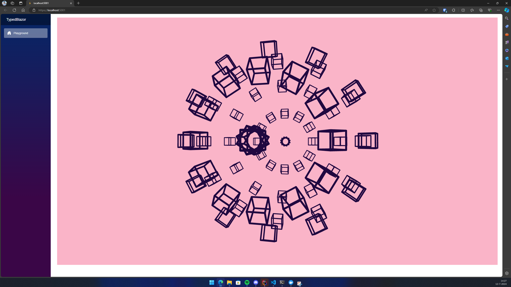

# TypedBlazor

TypedBlazor is a showcase implementation of Blazor Server combined with TypeScript and Node.js. <br> 
This project demonstrates how to use TypeScript to write strongly-typed code for Blazor components and services using JSInterop. <br> 
It utilizes the P5.js library alongside TypeScript to create a simple drawing application, benefiting from TypeScript's type checking, IntelliSense, and refactoring capabilities through the @types/p5 library.

## Features

- **Strongly Typed Scripts**: Leverage TypeScript for strongly typed scripts to ensure type safety and enhance development efficiency.
- **Node.js and NPM Integration**: Use Node.js with NPM for managing library type definitions and TypeScript dependencies.
- **Webpack Bundling**: Employ Webpack for bundling and minifying TypeScript code, essential for Blazor.

## Prerequisites

- **.NET 8.0**: Ensure you have .NET 8.0 installed.
- **Node.js with NPM**: Install Node.js along with NPM for managing dependencies.

## Getting Started

### Docker

To set up the project using Docker, follow these steps:

1. Generate HTTPS development certificates:
    ```bash
    dotnet dev-certs https -ep "$env:USERPROFILE\.aspnet\https\TypedBlazor.pfx" -p "mysupersecretpassword" --trust
    ```
2. Build and start the Docker containers:
    ```bash
    docker compose up --build
    ```

## Showcase

Here is an example of what the application looks like:


